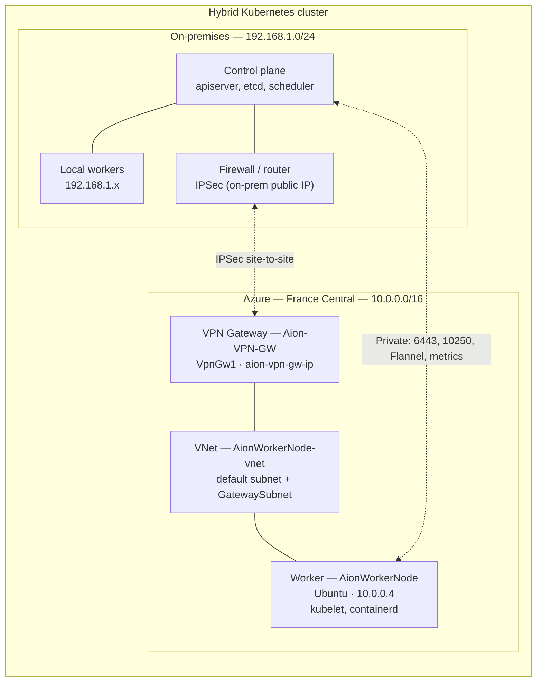
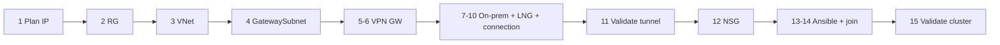
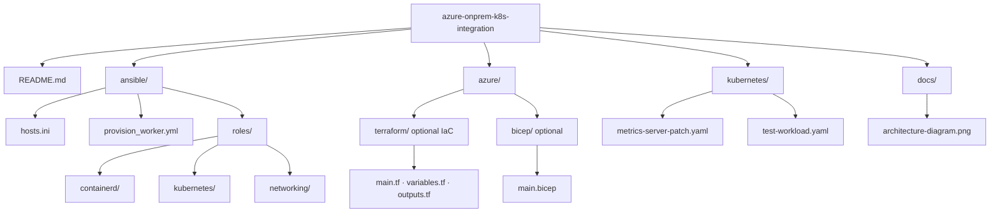

<div align="center">

```
```

# 🌐 Hybrid Kubernetes — Azure VM ↔ On-Premises Cluster Integration

> **Extend your on-prem Kubernetes cluster into Azure using a Site-to-Site VPN.**  
> A complete, production-oriented guide covering infrastructure provisioning, VPN setup,  
> Ansible automation, node joining, and operational troubleshooting.

---


</div>

---

## 📖 Table of Contents

- [Architecture Overview](#-architecture-overview)
- [Azure Resources Provisioned](#-azure-resources-provisioned)
- [Step-by-Step: Full Deployment Guide](#-step-by-step-full-deployment-guide)
  - [1. Network Planning](#1--network-planning)
  - [2. Create Azure Resource Group](#2--create-azure-resource-group)
  - [3. Create Virtual Network (VNet)](#3--create-virtual-network-vnet)
  - [4. Create GatewaySubnet](#4--create-gatewaysubnet-critical)
  - [5. Create Public IP for VPN Gateway](#5--create-public-ip-for-vpn-gateway)
  - [6. Create Azure VPN Gateway](#6--create-azure-vpn-gateway)
  - [7. Configure On-Premises Firewall](#7--configure-on-premises-firewallrouter)
  - [8. Create Local Network Gateway](#8--create-local-network-gateway)
  - [9. Create VPN Connection](#9--create-vpn-connection)
  - [10. Configure IPSec on On-Prem](#10--configure-ipsec-on-on-prem-firewall)
  - [11. Validate Tunnel & Connectivity](#11--validate-tunnel--connectivity)
  - [12. Configure NSG Rules](#12--configure-nsg-rules)
  - [13. Ansible Node Provisioning](#13--ansible-node-provisioning)
  - [14. Join Azure VM to Kubernetes](#14--join-azure-vm-to-kubernetes-cluster)
  - [15. Validate Cluster Integration](#15--validate-cluster-integration)
- [Troubleshooting](#-troubleshooting)
- [Security Considerations](#-security-considerations)
- [Project Structure](#-project-structure)

---

## 🏗 Architecture Overview

Hybrid layout: Kubernetes control plane on-premises; worker in Azure. Cluster plane traffic (API, kubelet `:10250`, Flannel overlay, metrics-server) rides the VPN with management—nothing depends on exposing those ports on the public internet.



**Traffic flows privately over the encrypted VPN tunnel — no services are exposed to the public internet.**

*Mermaid diagrams render on GitHub, GitLab, and many Markdown preview tools.*

---

## ☁️ Azure Resources Provisioned

| Resource | Name | Type | Purpose |
|---|---|---|---|
| 🗂 Resource Group | `Aion_VM_group` | Management scope | Groups all related resources |
| 🌐 Virtual Network | `AionWorkerNode-vnet` | `10.0.0.0/16` | Private cloud network |
| 🛡 NSG | `AionWorkerNode-nsg` | Security group | Port-level firewall rules |
| 💻 Virtual Machine | `AionWorkerNode` | Ubuntu LTS | Kubernetes worker node |
| 📡 Public IP (VM) | `AionWorkerNode-ip` | Static IP | VM management access |
| 🔐 VPN Gateway | `Aion-VPN-GW` | VpnGw1 SKU | IPSec tunnel endpoint |
| 📡 Public IP (VPN) | `aion-vpn-gw-ip` | Static IP | VPN tunnel endpoint |
| 🔗 VPN Connection | `Azure-To-OnPrem` | Site-to-Site | Tunnel to on-premises |
| 🔑 SSH Key | `AionWorkerNode_key` | SSH Key Pair | Secure VM access + Ansible |

---

## 🚀 Step-by-Step: Full Deployment Guide

End-to-end order (details in each step below):



### 1. 📐 Network Planning

Before creating any resources, define your full IP addressing plan:

| Component | Example Value | Your Value |
|---|---|---|
| On-Prem Network CIDR | `192.168.1.0/24` | ________ |
| Azure VNet CIDR | `10.0.0.0/16` | ________ |
| Azure Worker Node IP | `10.0.0.4` | ________ |
| GatewaySubnet | `10.0.255.0/27` | ________ |
| On-Prem Public IP | `YOUR_PUBLIC_IP` | ________ |
| VPN Type | `Site-to-Site IPSec` | — |

> ⚠️ **These two CIDRs must NOT overlap.** Overlapping ranges will silently break VPN routing.

---

### 2. 🗂 Create Azure Resource Group

```bash
# Via Azure CLI (alternative to Portal)
az group create \
  --name Aion_VM_group \
  --location francecentral
```

**Or via Portal:** `Azure Portal → Resource Groups → + Create`

| Setting | Value |
|---|---|
| Name | `Aion_VM_group` |
| Region | `France Central` |

---

### 3. 🌐 Create Virtual Network (VNet)

```bash
az network vnet create \
  --resource-group Aion_VM_group \
  --name AionWorkerNode-vnet \
  --address-prefix 10.0.0.0/16 \
  --subnet-name default \
  --subnet-prefix 10.0.0.0/24
```

---

### 4. 🔴 Create GatewaySubnet (**CRITICAL**)

> Azure VPN Gateways **require** a subnet named exactly `GatewaySubnet` — no other name is accepted.

```bash
az network vnet subnet create \
  --resource-group Aion_VM_group \
  --vnet-name AionWorkerNode-vnet \
  --name GatewaySubnet \
  --address-prefix 10.0.255.0/27
```

| Setting | Value |
|---|---|
| Subnet Name | `GatewaySubnet` ← must be **exact** |
| Address Range | `10.0.255.0/27` |

---

### 5. 📡 Create Public IP for VPN Gateway

```bash
az network public-ip create \
  --resource-group Aion_VM_group \
  --name aion-vpn-gw-ip \
  --sku Standard \
  --allocation-method Static
```

---

### 6. 🔐 Create Azure VPN Gateway

```bash
az network vnet-gateway create \
  --resource-group Aion_VM_group \
  --name Aion-VPN-GW \
  --vnet AionWorkerNode-vnet \
  --gateway-type Vpn \
  --vpn-type RouteBased \
  --sku VpnGw1 \
  --public-ip-address aion-vpn-gw-ip
```

> ⏱️ **This takes 30–45 minutes.** Azure is deploying IPSec services, tunnel endpoints, and routing infrastructure. Go grab a coffee ☕

---

### 7. 🏠 Configure On-Premises Firewall/Router

Your on-premises firewall/router must support:

- ✅ Static public IP address
- ✅ IPSec / IKEv2
- ✅ Site-to-Site VPN
- ✅ Policy-based or Route-based VPN

Common firewall platforms known to work: pfSense, OPNsense, Cisco ASA, FortiGate, Mikrotik, Ubiquiti EdgeRouter.

---

### 8. 🗺 Create Local Network Gateway

This Azure resource **represents your on-premises network** inside Azure.

```bash
az network local-gateway create \
  --resource-group Aion_VM_group \
  --name OnPrem-Gateway \
  --gateway-ip-address YOUR_ONPREM_PUBLIC_IP \
  --local-address-prefixes 192.168.1.0/24
```

| Setting | Value |
|---|---|
| Name | `OnPrem-Gateway` |
| Public IP | Your on-prem public IP |
| Address Space | `192.168.1.0/24` |

---

### 9. 🔗 Create VPN Connection

```bash
az network vpn-connection create \
  --resource-group Aion_VM_group \
  --name Azure-To-OnPrem \
  --vnet-gateway1 Aion-VPN-GW \
  --local-gateway2 OnPrem-Gateway \
  --shared-key "YOUR_STRONG_IPSEC_SECRET"
```

> 🔑 Use a strong, randomly generated shared key (32+ characters recommended).

---

### 10. 🔧 Configure IPSec on On-Prem Firewall

Configure the IPSec Phase 1 & 2 on your firewall with:

| Parameter | Value |
|---|---|
| Remote Endpoint | Azure VPN Gateway Public IP |
| Shared Secret | Same key as Step 9 |
| Local Subnet | `192.168.1.0/24` |
| Remote Subnet | `10.0.0.0/16` |
| IKE Version | IKEv2 (recommended) |
| Encryption | AES-256 |
| Hashing | SHA-256 |

---

### 11. ✅ Validate Tunnel & Connectivity

**In Azure Portal:**  
`VPN Gateway → Connections` → Status should show `Connected ✅`

**From on-premises → Azure VM:**
```bash
# Ping the Azure Worker Node via private IP
ping 10.0.0.4

# SSH via private IP (no public IP needed!)
ssh -i ~/.ssh/AionWorkerNode_key azureuser@10.0.0.4

# Validate kubelet is reachable (after node setup)
curl -k https://10.0.0.4:10250/metrics
# Expected response: 401 Unauthorized  ← THIS IS GOOD ✅
# It means: routing works, kubelet is reachable, TLS is working
```

> 💡 **`401 Unauthorized` is the success signal for kubelet reachability.** It confirms the VPN routing is correct and the kubelet port is accessible.

---

### 12. 🛡 Configure NSG Rules

The `AionWorkerNode-nsg` was configured with the following inbound rules:

| Priority | Port | Protocol | Purpose |
|---|---|---|---|
| 100 | 22 | TCP | SSH management |
| 200 | 6443 | TCP | Kubernetes API Server |
| 300 | 10250 | TCP | kubelet (metrics-server, control plane) |
| 400 | 8472 | UDP | Flannel VXLAN overlay networking |
| 500 | * | ICMP | Ping / connectivity tests |

```bash
# Example: allow kubelet port from on-prem CIDR only
az network nsg rule create \
  --resource-group Aion_VM_group \
  --nsg-name AionWorkerNode-nsg \
  --name Allow-Kubelet \
  --priority 300 \
  --protocol Tcp \
  --destination-port-range 10250 \
  --source-address-prefix 192.168.1.0/24 \
  --access Allow
```

---

### 13. 🤖 Ansible Node Provisioning

Ansible was used to automate the full Kubernetes worker node configuration on the Azure VM.

**Inventory file (`hosts.ini`):**
```ini
[azure_workers]
aion-worker ansible_host=10.0.0.4 ansible_user=azureuser ansible_ssh_private_key_file=~/.ssh/AionWorkerNode_key
```

**Core provisioning playbook (`provision_worker.yml`):**
```yaml
---
- name: Provision Kubernetes Worker Node
  hosts: azure_workers
  become: yes
  tasks:

    - name: Disable swap (required for Kubernetes)
      command: swapoff -a

    - name: Remove swap from fstab (persist across reboots)
      lineinfile:
        path: /etc/fstab
        regexp: '.*swap.*'
        state: absent

    - name: Load required kernel modules
      modprobe:
        name: "{{ item }}"
      loop:
        - overlay
        - br_netfilter

    - name: Configure sysctl for Kubernetes networking
      sysctl:
        name: "{{ item.key }}"
        value: "{{ item.value }}"
        sysctl_set: yes
        reload: yes
      loop:
        - { key: 'net.bridge.bridge-nf-call-iptables',  value: '1' }
        - { key: 'net.bridge.bridge-nf-call-ip6tables', value: '1' }
        - { key: 'net.ipv4.ip_forward',                 value: '1' }

    - name: Install containerd
      apt:
        name: containerd
        state: present
        update_cache: yes

    - name: Configure containerd
      shell: |
        mkdir -p /etc/containerd
        containerd config default > /etc/containerd/config.toml
        sed -i 's/SystemdCgroup = false/SystemdCgroup = true/' /etc/containerd/config.toml
      notify: Restart containerd

    - name: Add Kubernetes apt repository
      block:
        - apt_key:
            url: https://packages.cloud.google.com/apt/doc/apt-key.gpg
            state: present
        - apt_repository:
            repo: "deb https://apt.kubernetes.io/ kubernetes-xenial main"
            state: present

    - name: Install Kubernetes packages
      apt:
        name:
          - kubelet
          - kubeadm
          - kubectl
        state: present
        update_cache: yes

    - name: Hold Kubernetes packages at current version
      dpkg_selections:
        name: "{{ item }}"
        selection: hold
      loop:
        - kubelet
        - kubeadm
        - kubectl

  handlers:
    - name: Restart containerd
      service:
        name: containerd
        state: restarted
        enabled: yes
```

**Run the playbook:**
```bash
ansible-playbook -i hosts.ini provision_worker.yml
```

---

### 14. 🔗 Join Azure VM to Kubernetes Cluster

**On the control plane (on-premises master node):**
```bash
# Generate a fresh join token
kubeadm token create --print-join-command
```

This outputs a command like:
```bash
kubeadm join 192.168.1.10:6443 \
  --token abc123.def456ghi789jkl0 \
  --discovery-token-ca-cert-hash sha256:xxxxxxxxxxxxxxxxxxxxxxxxxxxxxxxxxxxxxxxxxxxxxxxxxxxxxxxxxxxxxxxx
```

**On the Azure VM worker node:**
```bash
# Run the join command as root
sudo kubeadm join 192.168.1.10:6443 \
  --token abc123.def456ghi789jkl0 \
  --discovery-token-ca-cert-hash sha256:xxxxxxxx...
```

**Expected output:**
```
[preflight] Running pre-flight checks
[preflight] Reading configuration from the cluster
[kubelet-start] Starting the kubelet
[kubelet-start] Waiting for the kubelet to perform the TLS Bootstrap
This node has joined the cluster:
* Certificate signing request was sent to apiserver and a response was received.
* The Kubelet was informed of the new secure connection details.
```

> 💡 **Tokens expire after 24 hours.** Always generate a fresh token before joining.

---

### 15. ✅ Validate Cluster Integration

```bash
# Check all nodes including the new Azure worker
kubectl get nodes -o wide

# Expected output:
# NAME              STATUS   ROLES           AGE   VERSION   INTERNAL-IP    ...
# master-node       Ready    control-plane   10d   v1.28.x   192.168.1.10   ...
# local-worker-1    Ready    <none>          10d   v1.28.x   192.168.1.11   ...
# AionWorkerNode    Ready    <none>          5m    v1.28.x   10.0.0.4       ...  ✅

# Check resource metrics
kubectl top nodes

# Verify kubelet logs on the Azure node
journalctl -u kubelet -f

# Confirm kubelet is listening
ss -tulnp | grep 10250

# Test metrics-server scraping from control plane
curl -k https://10.0.0.4:10250/metrics/resource
```

---

## 🔧 Troubleshooting

### ❌ metrics-server shows `<unknown>` for Azure node

**Symptom:**
```bash
kubectl top nodes
# NAME             CPU(cores)   CPU%   MEMORY(bytes)   MEMORY%
# AionWorkerNode   <unknown>    <unknown>   <unknown>   <unknown>
```

**Root cause:** metrics-server cannot communicate with kubelet on the Azure node over port `10250`.

**Fix:** Patch the metrics-server deployment:
```bash
kubectl patch deployment metrics-server \
  -n kube-system \
  --type='json' \
  -p='[
    {"op":"add","path":"/spec/template/spec/containers/0/args/-","value":"--kubelet-insecure-tls"},
    {"op":"add","path":"/spec/template/spec/containers/0/args/-","value":"--kubelet-preferred-address-types=InternalIP,ExternalIP,Hostname"}
  ]'
```

**Then verify:**
```bash
kubectl logs -n kube-system deployment/metrics-server
kubectl top nodes
```

---

### ❌ VPN tunnel status is "Not Connected"

```
✅ Check 1: On-prem firewall — is the shared key identical?
✅ Check 2: On-prem public IP — did it change? Update Local Network Gateway
✅ Check 3: Azure NSG — is UDP 500 and UDP 4500 allowed inbound?
✅ Check 4: On-prem firewall — IKEv2 enabled? Same encryption settings?
✅ Check 5: Azure gateway — still provisioning? Wait the full 45 min.
```

---

### ❌ Node stuck in `NotReady`

```bash
# Check kubelet status on Azure node
systemctl status kubelet

# Check kubelet logs
journalctl -u kubelet --since "10 minutes ago"

# Verify containerd is running
systemctl status containerd

# Check CNI (Flannel) pods
kubectl get pods -n kube-system | grep flannel

# Ensure swap is truly disabled
free -h  # Swap line should show: 0B  0B  0B
```

---

### ❌ `runc` permission denied errors

```bash
# Restart both services
systemctl restart containerd
systemctl restart kubelet

# Clean orphaned containers
crictl ps -a
crictl rm $(crictl ps -a -q)

# Verify containerd health
crictl info
```

---

## 🔒 Security Considerations

| Area | Recommendation |
|---|---|
| **VPN Key** | Use 32+ char random string; rotate periodically |
| **SSH** | Key-based auth only; disable password login |
| **NSG** | Restrict port 10250 to on-prem CIDR, not `0.0.0.0/0` |
| **kubelet** | Remove `--kubelet-insecure-tls` when using valid certs |
| **Tokens** | `kubeadm` tokens expire 24h; don't store them in plaintext |
| **RBAC** | Apply least-privilege roles on the worker node |
| **OS Updates** | Keep Ubuntu patched: `apt update && apt upgrade` |

---

## 📁 Project Structure



---


---

<div align="center">

**Built with 🖤 by a DevOps engineer extending on-prem Kubernetes into the cloud**

*Star ⭐ this repo if it helped you — it helps other engineers find it.*


</div>
